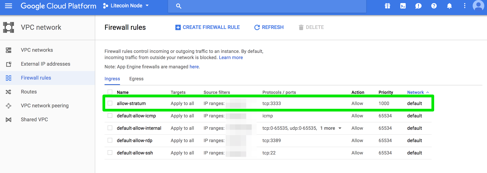

# Solo Mining Litecoin Tutorial
This tutorial provides instructions for setting up a Litecoin Node and a mining pool. For this tutorial, I used an old Gridseed that I have mining on "lottery" mode with Nice hash.

:email: mike@mikeghen.com

:electric_plug: Will get you set up and provide support/training for only 5 LTC


## Definitions
**Litecoin Node:** A server running [Litecoin Core](https://litecoin.org/) that maintains it's own blockchain. Litecoin nodes make up the backbone of the Litecoin network. By running your own node, you serve as a peer in the peer-to-peer network that is Litecoin.

**Mining Pool:** A server running [Stratum protocol](https://en.bitcoin.it/wiki/Stratum_mining_protocol) that can be connected to by mining rigs (e.g. A4+ LTC Master, Antminer L3+, Gridseed) using HTTP(S). The Stratum pool used in this tutorial is [UNOMP's Node Merged Pool](https://github.com/UNOMP/node-merged-pool).

## Prerequisites
You should be comfortable working on the command line and using Linux. For this tutorial, we will use a Ubuntu 16 virtual machine (I'm use Google Cloud Engine).

You will need to install and configure the Litecoin daemon running on Ubuntu. You will also need to install and configure Node Merged Pool which uses Node.js.

Understanding networking will help as well. Since you'll be running a few services that heavily depend on a reliable network connection.

You don't need to be a developer but to support this setup and solo mine for a long enough time to actually mine a block, you need system admin skills (might be wise to find a techie friend who can help admin this setup if this is something new to you)

## Getting Started
First, begin by setting up a Ubuntu server. You will need to have enough disk space for the blockchain. I'm using these specs on Google Cloud Engine:

* Ubuntu 16.04
* 1 vCPU
* 2.5 GB memory
* 100 GB disk

Once you have your server all setup just do an update before we get going:
```
sudo apt-get update
```

## Step 1: Installing Litecoin Core
You will need to install and configure Litecoin Core on your server. You will need to be running litecoind (Litecoin Daemon) as well. Litecoin Daemon needs to run 24/7/365 while mining is happening. Here's how I recommend to install it.

1. Change to `/opt` since that's where software should be install on Linux OSs:
```
cd /opt
```
2. Get Litecoin Core (double check you're getting the latest, at the time of writing 0.14.2 was the latest):
```
wget https://download.litecoin.org/litecoin-0.14.2/linux/litecoin-0.14.2-x86_64-linux-gnu.tar.gz
```
3. Uncompress Litecoin Core and remove the compressed file:
```
tar -xvzf litecoin-0.14.2-x86_64-linux-gnu.tar.gz
rm -rf litecoin-0.14.2-x86_64-linux-gnu.tar.gz
```
4. At this point, you've got Litecoin Core software in `/opt/litecoin-0.14.2`. Next, we need to configure the Litecoin Daemon

## Step 2: Starting Litecoin Daemon
First we will configure the Litecoin Daemon then we'll start it. Litecoin Daemon looks for a `litecoin.conf` file. If you go to `/opt/litecoin-0.14.2` and try running the daemon without a config you can see where it's looking for you configuration file:
```
cd /opt/litecoin-0.14.2
bin/litecoin-cli getinfo
```
This will produce the following message:
```
error: Could not locate RPC credentials. No authentication cookie could be found, and no rpcpassword is set in the
configuration file (/home/mike/.litecoin/litecoin.conf)
```
At this point, you can go ahead and create the configuration file in the path the the Deamon is looking (in my case `/home/mike/.litecoin/litecoin.conf`) or you can choose your only place to put it if your more advanced (maybe `/etc`).

Once you know where you will put your config file, here's how I recommend configuring your daemon:

1. Write the configuration below to `litecoin.conf`. In my case I did this like so:
```
vi /home/mike/.litecoin/litecoin.conf
```
Then I insert the configuration code:
**Sample Litecoin Daemon Configuration**
```
rpcuser=litecoinrpc
rpcpassword=pickASecurePassword
rpcport=2300
daemon=1
server=1
gen=0
```
2. Now you can start the Litecoin Daemon:
```
bin/litecoind
```
You should see:
```
Litecoin server starting
```
3. Wait a minute then run:
```
bin/litecoin-cli getinfo
```
And look at the output for the `"blocks"`. Run the command again and look at `"blocks"` again. Confirm the number of block is increasing. This means that the Litecoin Daemon is downloading the blockchain. This will continue until the daemon has downloaded the full blockchain (this is why you needed 100GB of disk).

:warning: You can configure the Litecoin Daemon to start after your server is restarted. You can do with by editting `crontab`. Run `crontab -e` and add:
```
@reboot /opt/litecoin-0.14.2/bin/litecoind
```
:warning: You will probably want to run Litecoin Daemon on two different servers for high availability. Not going to get into that here. (Email me for more about that.)

:warning: You DO NOT need to wait to download the full block chain to move onto the next steps.

## Step 3: Creating your Stratum Server (aka Mining Pool)
Now that we have Litecoin Daemon running, we can setup out Stratum server where we can connect our mining rig and start working.

First, we will install the OS dependancies needed.

1. Install Node.js, NPM, and NVM:
```
sudo apt-get install nodejs-legacy npm
curl -o- https://raw.githubusercontent.com/creationix/nvm/v0.33.6/install.sh | bash
```
After running `curl` to install NVM, you should see in your output something like:
```
=> Appending nvm source string to /home/mike/.bashrc
```
To use NVM, you'll first need to restart your terminal or reload `.bashrc`:
```
source /home/mike/.bashrc
```
We want to use Node.js 0.10 so run:
```
nvm install v0.10.25
```

:warning: Using a version other than Node.js 0.10 was causing problems for me...

2. Create a space to install [UNOMP's Node Merged Pool](https://github.com/UNOMP/node-merged-pool).
```
cd /opt
mkdir stratum-server
cd stratum-server
```
I like putting my software in `/opt`.
3. Next, we need to pull down the code we need from UNOMP:
```
git clone https://github.com/KillerByte/node-stratum-pool node_modules/stratum-pool
npm update
cp node_modules/stratum-pool/package.json package.json
npm install
```
4. Now that we have UNOMP's Node.js software, we need to create and configure our own Statrum Server. My example server code lives in `server.js`. From the server in `/opt/stratum-server` I do:
```
vi server.js
```
Then put in the contents of `server.js` and save the file.

At this point, I can run the stratum server like this:
```
node server.js
```
If the server was started successfully, you will start getting log messages on the command line. Since I wasn't done downloading the blockchain, I had these messages. I also remove the part about fees since this is a pool just for myself:
```
error: [POOL] No rewardRecipients have been setup which means no fees will be taken
error: [POOL] Daemon is still syncing with network (download blockchain) - server will be started once synced
warning: [POOL] Downloaded 95.50% of blockchain from 8 peers
warning: [POOL] Downloaded 95.51% of blockchain from 8 peers
warning: [POOL] Downloaded 95.53% of blockchain from 8 peers
warning: [POOL] Downloaded 95.56% of blockchain from 8 peers
warning: [POOL] Downloaded 95.59% of blockchain from 8 peers
warning: [POOL] Downloaded 95.62% of blockchain from 8 peers
```

Eventually, you will see this log:
```
special: [POOL] Stratum Pool Server Started for Litecoin [LTC] {scrypt}
                                                Network Connected:      Mainnet
                                                Detected Reward Type:   POW
                                                Current Block Height:   1323394
                                                Current Connect Peers:  8
                                                Current Block Diff:     98489231438.12776
                                                Network Difficulty:     31197366290.4415
                                                Network Hash Rate:      11.39 TH
                                                Stratum Port(s):        3256, 3333
                                                Pool Fee Percent:       0%
                                                Block polling every:    1000 ms
```
And then:
```
debug: [POOL] Block notification via RPC polling
debug: [POOL] No new blocks for 55 seconds - updating transactions & rebroadcasting work
debug: [POOL] Block notification via RPC polling
```
Then you're all set!

## Step 4: Daemonizing the Stratum Server
I'm a big fan of systemd on Ubuntu so I decided to daemonize my Statrum server using systemd. To do so, you will need to create a file `/etc/systemd/system/stratum-server.service`. The advantage of this is:
* Logs go to `system.log`
* You can use `service stratum-server start|stop|restart|status`
* You can check logs with `journalctl -u statum-server -e` or `-f` to tail
To set this up:

1. Create the service file by copying the contents of `etc/systemd/system/stratum-server.service` to your server:
```
vi /etc/systemd/system/stratum-server.service
```
Change the `ExecStart` line to match your setup for Node.
2. Start the service:
```
service stratum-server start
```
Check the status to make sure it was successful:
```
service stratum-server status
```
This should output:
```
● stratum-server.service - Stratum Server daemon
   Loaded: loaded (/etc/systemd/system/stratum-server.service; disabled; vendor preset: enabled)
   Active: active (running) since Sat 2017-12-02 20:10:05 UTC; 5min ago
```
3. Check the logs to make sure it's running:
```
journalctl -u stratum-server -e
```

## Step 5: Connect your rigs
At this point, your pool is all set and you can start working. Connect your miners to your pool as:

```
stratum+tcp://EXTERNAL_IP:3333
```

Where the EXTERNAL_IP is the external IP of your machine.

:warning: Make sure your firewall rules allow connection on this port.

Read the `server.js` file for more information about how to change pool settings.

## Why I Created My Own Pool and This Tutorial
I was participating in a pool and found 2 blocks which would have earn me a 50 LTC reward. As part of the pool however, I only earned a few LTC in that duration since it was a PPS pool.

I looked into solo mining and couldn't find anything about solo mining with Innoslicion equipment. I didn't want to SSH into my controllers and install anything so I looked into creating a pool where I could then connect my rigs to.

### More Nodes on the Network, Metcalf's Law
I also realized that creating my own pool meant I would be adding a node to the Litecoin network. More nodes mean more robust network so in a way I'm adding some value to the Litecoin network. This follows [Metcalf's Law](https://en.wikipedia.org/wiki/Metcalfe%27s_law) which values a network as the number of nodes to the power of 2. So by solo mining and running my own node, I'm actually increasing the value of the Litecoin network from `n^2` to `(n+1)^2`

## FAQ and Troubleshooting

#### What is socket flooding?
This means the difficulty is too low for your miner. I experienced this when I was using diff=32 and my A4+ LTCMaster cranks at 620MHs. Bumped the diff to 1024 and the problem went away. If you get socket flooding, you need to adjust your difficulty.

#### Why can I not reach my node on port 3333?
You probably forgot to open up the port at the VPC level.

Try using telnet to make sure the port is open:
```
telnet EXTERNAL_IP 3333
```
Make sure you can ping your instance first:
```
ping EXTERNAL_IP
```
